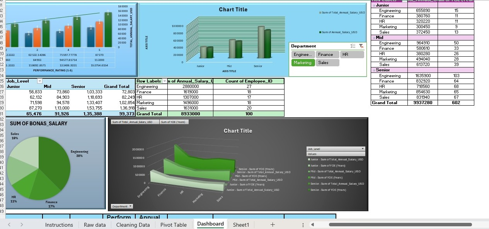

---

## 🎯 Project Objective

This project simulates a real-world HR analytics task. The goal was to:

- Identify and fix data quality issues in a raw employee dataset
- Build calculated fields for bonus and total compensation
- Use Pivot Tables to extract department and performance insights
- Design a professional dashboard for management decision-making

---

## 🗂️ Dataset Overview

| Field | Description |
|---|---|
| `Employee_ID` | Unique identifier for each employee |
| `Department` | One of 5 departments (Engineering, Sales, Marketing, Finance, HR) |
| `Job_Level` | Junior / Mid / Senior |
| `YOE (Years)` | Years of experience |
| `Performance_Rating (1-5)` | Annual performance score |
| `Annual_Salary_USD` | Base salary in USD |
| `Bonus_Percentage` | Bonus as a % of base salary |
| `Bonus_Salary` *(added)* | Calculated: Salary × Bonus % |
| `Total_Annual_Salary_USD` *(added)* | Calculated: Salary + Bonus |

> **100 employees | 5 Departments | 3 Job Levels**

---

## 🧹 Data Cleaning — 6 Tasks Applied

| # | Task | Excel Method Used |
|---|---|---|
| 1 | Handle Null / Missing Values | `IFERROR()`, `AVERAGEIF()` |
| 2 | Standardize Text Case | `PROPER()` |
| 3 | Remove Extra Spaces | `TRIM()` |
| 4 | Fix Date Formats | `TEXT()`, `DATEVALUE()` |
| 5 | Remove Duplicate Rows | Data → Remove Duplicates (VBA Macro) |
| 6 | Fix Data Types (text → number) | `VALUE()` |

---

## 📊 Dashboard — PayPerform 360

### KPI Summary Cards
| Metric | Value |
|---|---|
| Total Employees | 100 |
| Total Annual Payroll | $9,940,030 |
| Total Bonus Paid | $1,007,030 |
| Average Performance Rating | 3.63 / 5 |
| Average Years of Experience | 6.0 years |

### Charts Included
- 📊 **Average Salary by Department** — Horizontal bar chart
- 📊 **Average Salary by Job Level** — Column chart
- 🥧 **Employee Count by Department** — Pie chart
- 📊 **Total Payroll by Department** — Bar chart
- 📊 **Avg Performance Rating by Department** — Bar chart
- 📊 **Total Bonus Paid by Department** — Bar chart

---

## 🔍 Key Insights

- **Engineering** is the largest department (27%) and has the highest average salary at **$106,667/year**, consuming **33% of total payroll**
- **Performance Rating directly correlates with pay** — Rating 5 employees earn **$136,917** on average vs **$72,803** for Rating 2 employees
- **Senior employees** can earn up to **25% bonus**, while low-performing Juniors receive **0%**
- **HR** has the lowest average performance rating (3.35) — a potential area for organizational improvement
- **Total bonus payout** of $1.01M represents **10.2% of the total payroll budget**

---

## 🛠️ Tools & Techniques Used

- **Microsoft Excel** — Primary tool
- **Data Cleaning** — PROPER, TRIM, VALUE, IFERROR, AVERAGEIF, DATEVALUE, TEXT
- **Pivot Tables** — Multi-dimensional analysis by Department, Job Level, Performance Rating
- **Charts** — Bar, Column, Pie (native Excel charts)
- **VBA Macro** — Automated the Remove Duplicates step for reusability
- **Conditional Formatting** — Highlighted nulls and outliers in raw data
- **Dashboard Design** — KPI cards, chart layout, and visual formatting

---

## 📸 Preview

---

## 🚀 How to Use This File

1. Download the `.xlsx` file from this repository
2. Open in **Microsoft Excel** (2016 or later recommended)
3. Start from the **Instructions** sheet to understand the project flow
4. Review **Raw Data** → **Cleaning Data** to see before/after
5. Explore the **Pivot Table** sheet for summary analysis
6. Open the **Dashboard** sheet for the final visual output

---

## 👤 Author

**MOUSOM KOLEY AND ARNIK JANA**

## 📌 Tags

`Excel` `Data Cleaning` `HR Analytics` `Pivot Tables` `Dashboard` `Payroll Analysis` `Data Analytics` `Microsoft Excel` `KPI` `Data Visualization`
